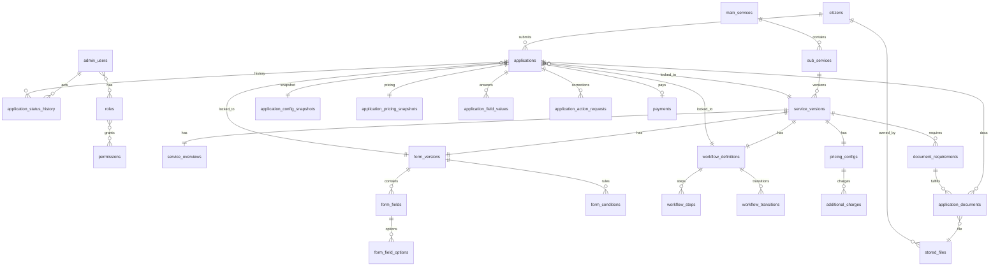

# Cybersave Platform — Project Audit & Architecture (Phase 1–7)

**Date:** 2026-08-07  
**Revision:** 2 — architecture decisions resolved  
**Status:** **Phase 8 scaffold complete** — backend foundation at `c:\cybersave\backend`  
**Repo layout:** `c:\cybersave\{ mobile, admin, backend, docs }`

---

## Executive Summary

Cybersave is a **UI-complete, backend-disconnected** digital services platform:

- **Mobile** (`mobile/`): Feature-based RN app. All business data in `constants/`. Axios + React Query scaffolded but unused. Auth is mock OTP.
- **Admin** (`admin/`): 9 feature modules with TanStack Query wired to mock services only. Service wizard UI matches Main → Sub → Overview → Form → Documents → Pricing → Publish but nothing is persisted.
- **Backend:** Does not exist. Must be created as **`c:\cybersave\backend`** (sibling to `mobile` and `admin`).

The frontends are **clients**. The backend is the **single source of truth** for services, forms, workflows, applications, payments, RBAC, and file storage.

### Mandatory corrections applied (Revision 2)

| # | Decision | Resolution |
|---|----------|------------|
| 1 | Workflow configuration | **Mandatory in v1** — per-service workflow definitions, steps, transitions, roles, actions, ACTION_REQUIRED |
| 2 | Document uploads | **Presigned direct-to-storage** via storage abstraction; backend registers metadata only |
| 3 | Application historical integrity | **Immutable version FKs + explicit snapshots** at submit; applications immune to future config changes |
| 4 | Authentication | **Separate citizen and admin identity** with shared roles/permissions infrastructure |
| 5 | Wallet | **Not in v1** — no fake balance; pay-per-application only; wallet deferred with future ledger design |
| 6 | Unresolved items | Removed from blocker list where decided below |

---

## Phase 1 — Project Audit (Summary)

Full audit retained from Revision 1. Key findings unchanged:

- Mobile: 41+ screens, all business data hardcoded in `constants/`
- Admin: professional UI, 100% mock services, wizard is local state only
- No backend, database, real auth, payments, or dynamic forms

See sections A–M in prior revision; architectural debt and preservation rules remain valid.

**Wallet note (v1):** Mobile wallet screens exist in UI but **must not** be backed by an incomplete wallet system. v1 uses **direct payment per application** (Razorpay or equivalent). Wallet integration is a documented future extension point.

---

# Architecture Decisions — Final (Pre–Phase 8)

The sections below are the **authoritative models** for implementation. No backend code until these are approved.

---

## 1. Final Entity Relationship Model

### Domain overview

```
┌─────────────────────────────────────────────────────────────────────────────┐
│                         IDENTITY & ACCESS (shared RBAC)                      │
│  citizens ──* applications          admin_users ──* admin_user_roles        │
│                                              └──* roles ──* permissions      │
└─────────────────────────────────────────────────────────────────────────────┘

┌─────────────────────────────────────────────────────────────────────────────┐
│                              SERVICE CATALOGUE                               │
│  main_services 1──* sub_services 1──* service_versions                       │
│       (lifecycle: DRAFT → UNDER_REVIEW → PUBLISHED → UNPUBLISHED → ARCHIVED) │
└─────────────────────────────────────────────────────────────────────────────┘

┌─────────────────────────────────────────────────────────────────────────────┐
│                    SERVICE VERSION CONFIGURATION (immutable when published)  │
│  service_version 1──1 service_overview                                       │
│                  1──1 form_version 1──* form_fields 1──* form_field_options  │
│                  1──* form_conditions                                        │
│                  1──* document_requirements                                  │
│                  1──1 pricing_config 1──* additional_charges                 │
│                  1──1 workflow_definition 1──* workflow_steps                │
│                                           1──* workflow_transitions          │
└─────────────────────────────────────────────────────────────────────────────┘

┌─────────────────────────────────────────────────────────────────────────────┐
│                              APPLICATION DOMAIN                              │
│  application *──1 citizen                                                    │
│              *──1 service_version      (IMMUTABLE FK)                        │
│              *──1 form_version         (IMMUTABLE FK)                          │
│              *──1 workflow_definition  (IMMUTABLE FK)                        │
│              1──1 application_config_snapshot (JSON at submit)               │
│              1──1 application_pricing_snapshot                               │
│              1──* application_field_values                                   │
│              1──* application_documents *──1 stored_files                    │
│              1──* application_status_history                                 │
│              1──* application_action_requests                                │
│              0..1 payment                                                    │
└─────────────────────────────────────────────────────────────────────────────┘

┌─────────────────────────────────────────────────────────────────────────────┐
│                           FILE STORAGE (abstraction)                         │
│  stored_files (metadata, storage_key, status, owner, mime, size)             │
│       ← presigned upload → S3 / local / Cloudinary via StorageProvider       │
└─────────────────────────────────────────────────────────────────────────────┘

┌─────────────────────────────────────────────────────────────────────────────┐
│                    PAYMENTS (v1 — no wallet ledger)                          │
│  payments, payment_transactions, payment_webhook_events                      │
└─────────────────────────────────────────────────────────────────────────────┘
```

### ER diagram (Mermaid)



### Cardinality rules

| Relationship | Rule |
|--------------|------|
| Application → ServiceVersion | Set once at draft creation; **never updated** |
| Application → FormVersion | Set once at draft creation; **never updated** |
| Application → WorkflowDefinition | Set once at draft creation; **never updated** |
| ServiceVersion (PUBLISHED) | **Immutable** — changes require new version (clone) |
| FormVersion (published) | **Immutable** — tied to service version lifecycle |
| WorkflowDefinition (published) | **Immutable** — tied to service version lifecycle |

---

## 2. Final Database Entity List

### Identity & access

| Entity | Table | Purpose |
|--------|-------|---------|
| Citizen | `citizens` | Mobile end-user identity (phone/email, profile, status) |
| AdminUser | `admin_users` | Admin portal identity (email, password hash, status) |
| OperatorProfile | `operator_profiles` | Extended admin user data (department, workload caps) |
| Role | `roles` | Named role (SUPER_ADMIN, ADMIN, OPERATOR, SUPPORT, FINANCE) |
| Permission | `permissions` | Granular permission key (`application:approve`, etc.) |
| RolePermission | `role_permissions` | Role ↔ permission mapping |
| AdminUserRole | `admin_user_roles` | Admin user ↔ role assignment |
| CitizenRefreshToken | `citizen_refresh_tokens` | Refresh tokens for mobile auth |
| AdminRefreshToken | `admin_refresh_tokens` | Refresh tokens for admin auth |
| CitizenOtpChallenge | `citizen_otp_challenges` | OTP verification sessions (hashed, expiring) |

**Decision:** Citizens and admin users are **separate tables** with **separate auth flows** and **separate refresh token stores**. Roles and permissions are **shared infrastructure**; only `admin_users` receive role assignments. Citizens are authorized as **resource owners** of their own applications (ownership checks, not RBAC permission matrix).

### Service catalogue

| Entity | Table | Purpose |
|--------|-------|---------|
| MainService | `main_services` | Top-level category (Aadhaar Services, PAN Services) |
| SubService | `sub_services` | Action under main service (Address Update, New PAN) |
| ServiceVersion | `service_versions` | Versioned, lifecycle-managed configuration bundle |

### Service version configuration

| Entity | Table | Purpose |
|--------|-------|---------|
| ServiceOverview | `service_overviews` | Display metadata, TAT, department, instructions, terms |
| FormVersion | `form_versions` | Form schema version bound to service version |
| FormField | `form_fields` | Field definition (type, key, label, order, config JSONB) |
| FormFieldOption | `form_field_options` | Dropdown/radio/checkbox options |
| FormCondition | `form_conditions` | Conditional visibility/requirement rules |
| DocumentRequirement | `document_requirements` | Required/optional docs per service version |
| PricingConfig | `pricing_configs` | Base fee, tax, currency |
| AdditionalCharge | `additional_charges` | Named surcharges with optional conditions |
| WorkflowDefinition | `workflow_definitions` | **v1 required** — processing workflow for service version |
| WorkflowStep | `workflow_steps` | Ordered steps mapped to application statuses |
| WorkflowTransition | `workflow_transitions` | Allowed moves: roles, permissions, actions, guards |

### Applications

| Entity | Table | Purpose |
|--------|-------|---------|
| Application | `applications` | Core application record + current workflow step/status |
| ApplicationConfigSnapshot | `application_config_snapshots` | Frozen service/form/doc/workflow config at submit |
| ApplicationPricingSnapshot | `application_pricing_snapshots` | Frozen pricing at submit |
| ApplicationFieldValue | `application_field_values` | Submitted/draft field answers |
| ApplicationDocument | `application_documents` | Link application ↔ requirement ↔ stored file |
| ApplicationStatusHistory | `application_status_history` | Audit trail of status/step changes |
| ApplicationActionRequest | `application_action_requests` | ACTION_REQUIRED correction requests |
| ApplicationInternalNote | `application_internal_notes` | Operator-only notes |

### File storage

| Entity | Table | Purpose |
|--------|-------|---------|
| StoredFile | `stored_files` | File metadata, storage provider key, upload lifecycle |
| UploadSession | `upload_sessions` | Presigned upload intent (expiry, expected mime/size) |

### Payments (v1 — application-scoped, no wallet)

| Entity | Table | Purpose |
|--------|-------|---------|
| Payment | `payments` | Payment intent/order for an application |
| PaymentTransaction | `payment_transactions` | Provider events, captures, failures |
| PaymentWebhookEvent | `payment_webhook_events` | Raw webhook log for reconciliation |
| Refund | `refunds` | Refund records linked to payment |

**Not in v1:** `wallet_accounts`, `wallet_ledger_entries` — see §7 Wallet deferral.

### Operations & platform

| Entity | Table | Purpose |
|--------|-------|---------|
| Notification | `notifications` | In-app notifications |
| NotificationDelivery | `notification_deliveries` | Channel delivery status |
| SupportTicket | `support_tickets` | User support cases |
| TicketMessage | `ticket_messages` | Ticket thread |
| AuditLog | `audit_logs` | Administrative audit trail |

### Critical indexes & constraints

```sql
-- Uniqueness
UNIQUE applications(public_ref)
UNIQUE form_fields(form_version_id, key)
UNIQUE workflow_steps(workflow_definition_id, step_key)
UNIQUE payments(idempotency_key)
UNIQUE stored_files(storage_key)

-- Immutability enforced in application service layer + DB triggers optional:
-- applications.service_version_id, form_version_id, workflow_definition_id NOT NULL, no UPDATE allowed

-- Query performance
INDEX applications(citizen_id, status)
INDEX applications(service_version_id)
INDEX service_versions(sub_service_id, lifecycle_status)
INDEX audit_logs(created_at, resource_type, resource_id)
INDEX stored_files(owner_citizen_id, status)
```

### JSONB usage (controlled)

Use JSONB **only** for:

- `form_fields.config` — type-specific field configuration
- `form_fields.validation` — validation rules
- `form_conditions.rule` — condition expression
- `application_config_snapshots.payload` — denormalized config freeze at submit
- `workflow_transitions.guard_config` — optional transition guards

Do **not** store entire applications or service configs as uncontrolled JSON blobs.

---

## 3. Final Workflow Model (v1 — Mandatory)

Administrators **must** configure the service processing workflow before publish. Workflow is part of the service version bundle, versioned and snapshotted with applications.

### Concepts

| Concept | Description |
|---------|-------------|
| **WorkflowDefinition** | One per `ServiceVersion`. Defines how applications for this service move through processing. |
| **WorkflowStep** | An ordered stage tied to an **application status** (and optional internal sub-state). |
| **WorkflowTransition** | A directed edge: from step → to step, with authorization and side effects. |
| **WorkflowAction** | Named operation an actor can invoke (e.g. `APPROVE`, `REJECT`, `REQUEST_CORRECTION`, `ASSIGN`, `COMPLETE`). |
| **Application current step** | Application tracks `current_workflow_step_id` (or status derived from step). |

### Standard application statuses (platform enum)

Platform-wide status enum; **workflow steps map to subsets** of these:

```
DRAFT
FORM_IN_PROGRESS
DOCUMENTS_PENDING
PAYMENT_PENDING
SUBMITTED
UNDER_REVIEW
ACTION_REQUIRED
PROCESSING
APPROVED
REJECTED
COMPLETED
CANCELLED
```

Citizen-visible phases (pre-submit) are **fixed by platform**. Post-submit phases are **configured per service** via workflow steps.

### Workflow step structure

```typescript
// Conceptual — implementation types in backend
WorkflowStep {
  id
  workflowDefinitionId
  stepKey          // stable key, e.g. "document_verification"
  name             // display: "Document Verification"
  description
  sortOrder
  applicationStatus // maps to platform ApplicationStatus enum
  isInitial         // first post-submit step (usually UNDER_REVIEW)
  isTerminal        // APPROVED, REJECTED, COMPLETED, CANCELLED
  citizenVisible    // show in mobile timeline
  slaHours          // optional SLA hint for operators
}
```

### Workflow transition structure

```typescript
WorkflowTransition {
  id
  workflowDefinitionId
  fromStepId
  toStepId
  actionKey         // APPROVE | REJECT | REQUEST_CORRECTION | START_PROCESSING | COMPLETE | CANCEL | ...
  label             // UI label for admin
  allowedRoleIds[]  // which roles may execute
  requiredPermissions[] // e.g. application:approve
  requiresComment   // boolean
  requiresAssignment // boolean
  createsActionRequest // true for REQUEST_CORRECTION → ACTION_REQUIRED
  notifyCitizen     // trigger notification on transition
}
```

### Default workflow template (seed for new services)

Admin can customize; platform provides a **default template** cloned into new service versions:

```
SUBMITTED (auto on citizen submit)
    → UNDER_REVIEW        [action: START_REVIEW, roles: OPERATOR, ADMIN]
UNDER_REVIEW
    → PROCESSING          [action: START_PROCESSING]
    → ACTION_REQUIRED     [action: REQUEST_CORRECTION, createsActionRequest]
    → REJECTED            [action: REJECT, requiresComment]
    → APPROVED            [action: APPROVE]
ACTION_REQUIRED
    → UNDER_REVIEW        [action: RESUME_REVIEW, citizen submitted correction]
    → PROCESSING          [action: RESUME_PROCESSING]
PROCESSING
    → COMPLETED           [action: COMPLETE]
    → ACTION_REQUIRED     [action: REQUEST_CORRECTION]
APPROVED
    → COMPLETED           [action: COMPLETE, optional auto]
```

### ACTION_REQUIRED / correction flow

1. Operator executes transition with `actionKey = REQUEST_CORRECTION` → application status `ACTION_REQUIRED`.
2. System creates **ApplicationActionRequest**:
   - `reason`, `instructions`, `requiredDocumentRequirementIds[]`, `requiredFieldKeys[]`, `deadline`, `status: OPEN`
3. Citizen notified (push/in-app).
4. Citizen uploads missing docs via presigned flow and/or updates allowed fields.
5. Citizen calls `POST /applications/:id/corrections/submit`.
6. Backend validates correction against action request scope.
7. Operator transition `RESUME_REVIEW` or `RESUME_PROCESSING` returns application to workflow.

### Workflow enforcement rules

1. **Only transitions defined in the application's snapshotted workflow** may be executed (post-submit).
2. Backend validates: current step, actor role/permission, required comment, assignment rules.
3. Every transition writes **ApplicationStatusHistory** (from, to, actor, action, comment, timestamp).
4. Publish validation **fails** if workflow has no initial step, no terminal paths, or orphan steps.
5. Workflow is included in **ApplicationConfigSnapshot** at submit.

### Admin wizard integration

Service wizard gains **Workflow** step (between Pricing and Publish, or merged into Publish checklist):

- Visual step list + transition editor
- Role/permission picker per transition
- Preview citizen timeline vs operator pipeline

---

## 4. Final Authentication & RBAC Model

### Identity boundaries (resolved)

```
┌──────────────────────┐     ┌──────────────────────┐
│      CITIZENS        │     │     ADMIN USERS       │
│  (mobile app)        │     │  (admin dashboard)    │
├──────────────────────┤     ├──────────────────────┤
│ Table: citizens      │     │ Table: admin_users    │
│ Auth: OTP (phone)    │     │ Auth: email+password  │
│ JWT aud: citizen     │     │ JWT aud: admin        │
│ Refresh: citizen_*   │     │ Refresh: admin_*      │
│ Guards: ownership    │     │ Guards: RBAC          │
└──────────────────────┘     └──────────────────────┘
              │                         │
              └───────────┬─────────────┘
                          ▼
              ┌──────────────────────┐
              │  roles + permissions  │
              │  (shared tables)      │
              └──────────────────────┘
```

### Citizen authentication

| Aspect | Design |
|--------|--------|
| Primary login | Phone OTP (SMS provider abstraction) |
| Registration | Phone + optional profile fields |
| Tokens | Access JWT (short TTL, e.g. 15m) + refresh token (rotating) |
| JWT claims | `sub`, `type: citizen`, `aud: cybersave-mobile` |
| Authorization | **Resource ownership** — citizen can only access own applications, files, profile |
| Storage | `citizen_refresh_tokens` with device metadata, revocation support |

### Admin authentication

| Aspect | Design |
|--------|--------|
| Primary login | Email + password (bcrypt/argon2) |
| Tokens | Access JWT + refresh token (rotating) |
| JWT claims | `sub`, `type: admin`, `aud: cybersave-admin`, `roles[]`, optional `permissions[]` |
| Authorization | **RBAC** — `@RequirePermissions()` on admin routes |
| MFA | Future extension point (not blocking v1) |
| Storage | `admin_refresh_tokens` |

### Shared RBAC tables

```typescript
Role {
  id, key, name, description, isSystem
}

Permission {
  id, key, name, module, description
}

RolePermission { roleId, permissionId }

AdminUserRole { adminUserId, roleId, assignedAt, assignedBy }
```

### System roles (seed data)

| Role | Purpose |
|------|---------|
| SUPER_ADMIN | Full platform access |
| ADMIN | Service config, user management, applications |
| OPERATOR | Application processing, assigned work |
| SUPPORT | Tickets, limited user view |
| FINANCE | Payments, refunds, transaction reports |

### Permission examples (non-exhaustive)

```
service:create, service:update, service:publish, service:archive
form:create, form:update, form:publish
workflow:configure
application:view, application:view_all, application:assign
application:transition, application:approve, application:reject
application:request_correction
payment:view, payment:refund
user:view, user:manage
admin:manage, role:manage
audit:view, reports:view
```

### Enforcement

- **Backend:** NestJS guards — `CitizenAuthGuard`, `AdminAuthGuard`, `PermissionsGuard`
- **Admin frontend:** Permission hooks for UI visibility only (never authoritative)
- **Mobile:** No permission matrix; route guards based on auth state only
- **Audit:** All admin mutations log `actorAdminUserId`

---

## 5. Final File Upload & Storage Flow

### Storage abstraction

```typescript
interface StorageProvider {
  generateUploadUrl(params: UploadUrlRequest): Promise<PresignedUpload>;
  generateDownloadUrl(params: DownloadUrlRequest): Promise<PresignedDownload>;
  deleteObject(storageKey: string): Promise<void>;
  verifyObjectExists(storageKey: string): Promise<ObjectMetadata>;
}

// Implementations: LocalStorageProvider (dev), S3StorageProvider (prod), CloudinaryStorageProvider (optional)
```

Configuration via env: `STORAGE_PROVIDER=local|s3|cloudinary`

### Upload lifecycle

```
PENDING → UPLOADED → VERIFIED → ATTACHED
                  ↘ EXPIRED / FAILED
```

| Status | Meaning |
|--------|---------|
| PENDING | Upload session created, presigned URL issued, client has not finished |
| UPLOADED | Client reported completion; object exists in storage |
| VERIFIED | Backend validated mime, size, virus scan hook (future) |
| ATTACHED | Linked to application document requirement |
| EXPIRED | Session TTL elapsed without completion |

### Sequence: application document upload

```
Citizen App                Backend API              Storage (S3/local)
     │                          │                          │
     │ POST .../uploads/request │                          │
     │ {requirementId, mime,    │                          │
     │  size, fileName}         │                          │
     │─────────────────────────>│                          │
     │                          │ validate requirement     │
     │                          │ create upload_session    │
     │                          │ create stored_file       │
     │                          │ generate presigned URL   │
     │                          │─────────────────────────>│
     │  {uploadSessionId,       │                          │
     │   uploadUrl, headers,    │                          │
     │   expiresAt}             │                          │
     │<─────────────────────────│                          │
     │                          │                          │
     │ PUT/POST file direct     │                          │
     │────────────────────────────────────────────────────>│
     │                          │                          │
     │ POST .../uploads/complete│                          │
     │ {uploadSessionId,        │                          │
     │  checksum?}              │                          │
     │─────────────────────────>│                          │
     │                          │ verify object exists     │
     │                          │ validate mime/size       │
     │                          │ mark VERIFIED            │
     │                          │ attach to application    │
     │  {fileId, status}        │                          │
     │<─────────────────────────│                          │
```

### API design principles

- **Large files never stream through NestJS** in production (except local dev fallback).
- Presigned URLs are **short-lived** (e.g. 15 minutes).
- `upload_sessions` bind: `citizenId`, optional `applicationId`, `documentRequirementId`, expected mime/size.
- Download: `GET .../files/:id/download-url` returns presigned read URL after authorization check.
- **Private by default** — no public bucket URLs for application documents.

### StoredFile entity

```typescript
StoredFile {
  id
  storageProvider     // local | s3 | cloudinary
  storageKey          // provider object key
  originalFileName
  mimeType
  sizeBytes
  checksumSha256      // optional, set on complete
  status              // PENDING | UPLOADED | VERIFIED | ATTACHED | ...
  ownerCitizenId
  uploadSessionId
  createdAt, verifiedAt, attachedAt
}
```

### ApplicationDocument entity

```typescript
ApplicationDocument {
  id
  applicationId
  documentRequirementId   // from snapshotted requirements
  storedFileId
  status                  // PENDING | SUBMITTED | ACCEPTED | REJECTED
  rejectionReason
  uploadedAt
}
```

---

## 6. Final Application Snapshot & Versioning Strategy

### Principle

An application must remain a **permanent historical record** of what the citizen saw, agreed to, paid for, and submitted — **unaffected** by any subsequent admin changes to service configuration.

### Immutable foreign keys (set at draft creation, never updated)

| FK | When set | Rule |
|----|----------|------|
| `service_version_id` | `POST /applications` | Points to current **PUBLISHED** service version |
| `form_version_id` | `POST /applications` | Form version bundled with that service version |
| `workflow_definition_id` | `POST /applications` | Workflow bundled with that service version |
| `citizen_id` | creation | Never changes |

Database: application service layer rejects updates to these columns. Optional DB trigger as defense in depth.

### Version immutability (catalogue side)

When `ServiceVersion.lifecycle_status = PUBLISHED`:

- No UPDATE to form fields, document requirements, pricing, workflow, or overview
- Changes require: **clone version → edit draft → validate → publish new version**
- Old applications keep old version FKs forever

### Snapshot layers

| Layer | When captured | Contents | Purpose |
|-------|---------------|----------|---------|
| **Live draft reference** | Draft creation | FKs to published versions | Drive dynamic form rendering while in progress |
| **Field values** | Continuous save | `application_field_values` | Draft/resume |
| **Config snapshot** | On **submit** (after payment verified) | Full denormalized JSON in `application_config_snapshots` | Historical display even if version rows archived |
| **Pricing snapshot** | On **submit** | `application_pricing_snapshots` table | Immutable price, tax, charges, total paid |
| **Workflow snapshot** | On **submit** | Embedded in config snapshot OR `workflow_snapshot_json` | Enforce transitions for this application forever |

### ApplicationConfigSnapshot payload (at submit)

Denormalized structure stored once:

```json
{
  "serviceVersionNumber": 2,
  "subServiceName": "Address Update",
  "mainServiceName": "Aadhaar Services",
  "overview": { "displayName", "instructions", "terms", "processingTime" },
  "form": {
    "versionNumber": 2,
    "fields": [ /* full field defs as citizen saw them */ ],
    "conditions": [ /* rules at submit time */ ]
  },
  "documentRequirements": [ /* names, required, formats, instructions */ ],
  "workflow": {
    "steps": [ /* step keys, names, statuses */ ],
    "transitions": [ /* allowed transitions */ ]
  }
}
```

### Pricing snapshot (normalized table)

```typescript
ApplicationPricingSnapshot {
  applicationId
  baseFee, taxAmount, taxRate, currency
  additionalCharges[]  // JSON array of { name, amount }
  discountAmount
  totalAmount          // what payment was created for
  capturedAt
}
```

### Post-submit behavior

| Admin action | Effect on existing application |
|--------------|-------------------------------|
| Publish new service version @ ₹150 | **None** — app still shows ₹100 from pricing snapshot |
| Add/remove form field | **None** — snapshot preserves original fields |
| Change document requirements | **None** — snapshot + uploaded docs unchanged |
| Change workflow | **None** — application uses snapshotted workflow transitions |
| Archive service version | Application FKs remain valid; snapshot provides display fallback |

### Display rules

- **Admin application detail:** Render from snapshot + field values + stored files (not live service config).
- **Mobile application detail:** Same — snapshot for labels/requirements; live data only for actionable corrections (ACTION_REQUIRED scoped to operator request).
- **Validation on submit:** Validate against **live published version** at submit time, then freeze.

### Draft vs submitted

| State | Config source |
|-------|---------------|
| DRAFT … PAYMENT_PENDING | Live published version via FKs (allows admin to unpublish before submit — see edge case) |
| SUBMITTED+ | Snapshots + FKs |

**Edge case — unpublish before submit:** If service unpublished while citizen has draft, backend blocks submit with clear error; citizen must start new application when service re-published.

---

## 7. Wallet Deferral (v1)

| Aspect | v1 decision |
|--------|-------------|
| Mobile wallet UI | **Keep as mock UI** — no backend wallet APIs |
| Payment model | **Direct payment per application** via PaymentProvider |
| Admin transactions | **Payment transactions only** (not wallet ledger) |
| Database | No wallet tables in v1 |

### Future wallet design (when product confirms)

```
wallet_accounts (citizen_id, currency, status)
wallet_ledger_entries (
  id, wallet_account_id, type: CREDIT|DEBIT|REFUND|ADJUSTMENT|HOLD|RELEASE,
  amount, balance_after, reference_type, reference_id, idempotency_key, created_at
)
```

Rules: append-only ledger, no mutable balance column without reconciliation, all movements idempotent.

Mobile wallet screens integrate only when this ledger exists.

---

## 8. Final API Contract List

Base URL: `/api/v1`  
Admin prefix: `/api/v1/admin`  
Auth: `Authorization: Bearer <access_token>`

### Response envelope

```json
{
  "success": true,
  "data": {},
  "meta": { "page": 1, "limit": 20, "total": 100, "totalPages": 5 }
}
```

```json
{
  "success": false,
  "error": { "code": "VALIDATION_ERROR", "message": "...", "details": [] }
}
```

---

### Citizen auth (`/api/v1/auth`)

| Method | Path | Description |
|--------|------|-------------|
| POST | `/auth/otp/request` | Request OTP for phone |
| POST | `/auth/otp/verify` | Verify OTP, issue tokens |
| POST | `/auth/register` | Complete registration if new citizen |
| POST | `/auth/refresh` | Rotate refresh token |
| POST | `/auth/logout` | Revoke refresh token |
| GET | `/auth/me` | Current citizen profile |

---

### Admin auth (`/api/v1/admin/auth`)

| Method | Path | Description |
|--------|------|-------------|
| POST | `/admin/auth/login` | Email + password login |
| POST | `/admin/auth/refresh` | Rotate admin refresh token |
| POST | `/admin/auth/logout` | Revoke refresh token |
| GET | `/admin/auth/me` | Current admin user + roles + permissions |

---

### Services — citizen (`/api/v1/services`)

| Method | Path | Description |
|--------|------|-------------|
| GET | `/services` | Published main services with nested published sub-services |
| GET | `/services/sub/:subServiceId` | Sub-service summary (published) |
| GET | `/services/sub/:subServiceId/configuration` | **UI-ready config:** overview, form, fields, conditions, documents, pricing, workflow (citizen-visible subset), terms |

---

### Applications — citizen (`/api/v1/applications`)

| Method | Path | Description |
|--------|------|-------------|
| POST | `/applications` | Create draft `{ subServiceId }` — binds published version FKs |
| GET | `/applications/drafts` | List citizen's draft applications |
| GET | `/applications` | List citizen's applications (paginated, filter by status) |
| GET | `/applications/:id` | Detail + timeline + action requests |
| PATCH | `/applications/:id/form` | Save field values (draft states) |
| POST | `/applications/:id/validate` | Validate form + documents (pre-payment) |
| POST | `/applications/:id/uploads/request` | Request presigned upload URL |
| POST | `/applications/:id/uploads/complete` | Confirm upload + attach to requirement |
| DELETE | `/applications/:id/documents/:documentId` | Remove draft document (if allowed) |
| POST | `/applications/:id/payment-intent` | Create payment order (idempotent) |
| POST | `/applications/:id/submit` | Submit after verified payment + create snapshots |
| POST | `/applications/:id/corrections/submit` | Submit correction for ACTION_REQUIRED |
| POST | `/applications/:id/cancel` | Cancel draft or eligible states |

---

### Files — citizen (`/api/v1/files`)

| Method | Path | Description |
|--------|------|-------------|
| GET | `/files/:id/download-url` | Presigned download (ownership check) |

---

### Profile & notifications — citizen

| Method | Path | Description |
|--------|------|-------------|
| GET | `/profile` | Citizen profile |
| PATCH | `/profile` | Update profile |
| GET | `/notifications` | In-app notifications |
| PATCH | `/notifications/:id/read` | Mark read |
| POST | `/support/tickets` | Create support ticket |
| GET | `/support/tickets` | List own tickets |

---

### Main & sub services — admin (`/api/v1/admin`)

| Method | Path | Description |
|--------|------|-------------|
| GET | `/admin/main-services` | List (paginated) |
| POST | `/admin/main-services` | Create |
| GET | `/admin/main-services/:id` | Detail with sub-services |
| PATCH | `/admin/main-services/:id` | Update |
| POST | `/admin/main-services/:id/reorder` | Reorder |
| POST | `/admin/main-services/:id/archive` | Archive |
| POST | `/admin/sub-services` | Create `{ mainServiceId, ... }` |
| PATCH | `/admin/sub-services/:id` | Update |
| POST | `/admin/sub-services/:id/reorder` | Reorder |
| POST | `/admin/sub-services/:id/versions` | Create new draft version (optional clone from latest) |

---

### Service version wizard — admin

| Method | Path | Description |
|--------|------|-------------|
| GET | `/admin/service-versions/:id` | Full draft/published bundle |
| PUT | `/admin/service-versions/:id/overview` | Save overview step |
| PUT | `/admin/service-versions/:id/form` | Save form fields, options, conditions |
| PUT | `/admin/service-versions/:id/documents` | Save document requirements |
| PUT | `/admin/service-versions/:id/pricing` | Save pricing + additional charges |
| PUT | `/admin/service-versions/:id/workflow` | **Save workflow steps + transitions** |
| GET | `/admin/service-versions/:id/preview` | Preview citizen-facing config |
| POST | `/admin/service-versions/:id/validate` | Pre-publish validation |
| POST | `/admin/service-versions/:id/publish` | Publish (immutable) |
| POST | `/admin/service-versions/:id/unpublish` | Unpublish |
| POST | `/admin/service-versions/:id/archive` | Archive |

---

### Applications — admin

| Method | Path | Description |
|--------|------|-------------|
| GET | `/admin/applications` | Search, filter, sort, paginate |
| GET | `/admin/applications/:id` | Detail from snapshot + values + docs + payment |
| GET | `/admin/applications/:id/history` | Status/workflow history |
| POST | `/admin/applications/:id/assign` | Assign operator |
| GET | `/admin/applications/:id/transitions` | Available transitions for current actor |
| POST | `/admin/applications/:id/transitions` | Execute workflow transition `{ actionKey, comment }` |
| POST | `/admin/applications/:id/action-required` | Shortcut: request correction with payload |
| POST | `/admin/applications/:id/notes` | Internal note |

---

### Users & operators — admin

| Method | Path | Description |
|--------|------|-------------|
| GET | `/admin/citizens` | Paginated citizen search |
| GET | `/admin/citizens/:id` | Profile + applications summary |
| GET | `/admin/admin-users` | List admin users / operators |
| POST | `/admin/admin-users` | Create admin user |
| PATCH | `/admin/admin-users/:id` | Update, activate/deactivate |
| PUT | `/admin/admin-users/:id/roles` | Assign roles |
| GET | `/admin/roles` | List roles |
| GET | `/admin/permissions` | List permissions |

---

### Payments — admin

| Method | Path | Description |
|--------|------|-------------|
| GET | `/admin/payments` | Paginated payment list |
| GET | `/admin/payments/:id` | Payment detail |
| POST | `/admin/payments/:id/refund` | Initiate refund |
| POST | `/webhooks/payments/:provider` | Provider webhook (server-to-server, no auth header — signature verified) |

---

### Platform — admin

| Method | Path | Description |
|--------|------|-------------|
| GET | `/admin/dashboard/summary` | KPI aggregates |
| GET | `/admin/analytics/*` | Scoped analytics endpoints |
| GET | `/admin/notifications` | Admin notification center |
| POST | `/admin/notifications/send` | Send notification to citizen(s) |
| GET | `/admin/support/tickets` | Ticket list |
| GET | `/admin/support/tickets/:id` | Ticket detail |
| POST | `/admin/support/tickets/:id/messages` | Reply |
| POST | `/admin/support/tickets/:id/resolve` | Resolve |
| GET | `/admin/audit-logs` | Paginated audit log |
| GET | `/admin/settings` | Portal settings |
| PATCH | `/admin/settings` | Update settings |

---

### Publish validation rules (backend)

Cannot publish service version unless:

- Overview name and description present
- Form has ≥1 field, no duplicate keys, valid conditions
- Document requirements valid (formats, sizes)
- Pricing valid (base fee ≥ 0, currency set)
- **Workflow has initial step, ≥1 terminal step, connected transitions, role assignments**
- No broken conditional references

---

## Resolved Decisions (was open in Revision 1)

| Question | Decision |
|----------|----------|
| Single users table vs separate | **Separate:** `citizens` + `admin_users` |
| Wallet in v1 | **No** — direct per-application payment only |
| Workflow in v1 | **Yes — mandatory**, per service version |
| Operator assignment | Manual assign + optional self-claim from queue (v1); rule-based later |
| Multi-language | **Out of v1 scope** — English first; schema allows future `locale` columns |
| Mock catalogue seed | **Optional dev seed** — not production requirement |

---

## Implementation Status (Revision 3 — Aug 2026)

| Area | Status |
|------|--------|
| Backend (NestJS + Prisma) | **Complete** — auth, RBAC, services wizard + publish, applications lifecycle, mock payments, dashboard, audit logs, notifications, support |
| Admin dashboard | **Integrated** — real APIs for services, users, applications, operators, transactions, audit, analytics (partial charts) |
| Mobile citizen app | **Integrated** — OTP auth, dynamic services/forms, full apply flow (form → upload → review → payment → submit) |
| Wallet | **Deferred** — mobile UI mock only (per v1 architecture) |
| Razorpay | **Not implemented** — mock payment provider only |
| Production CI/CD | **Not set up** |

### End-to-end citizen flow

1. Admin publishes service via wizard  
2. Mobile: browse `GET /services` → apply with dynamic form  
3. Upload documents (presigned local storage)  
4. Mock payment capture → submit with snapshots  
5. Admin: review, assign operator, workflow transitions  

### Remaining for hard production

- Real payment gateway (Razorpay) + webhook signatures  
- Dashboard time-series analytics APIs  
- Operator detail tabs (permissions/documents) — mock UI data  
- Settings/profile persistence in admin  
- E2E test coverage beyond smoke tests  
- CI/CD pipeline  

---

## Phase 7 — Remaining Gaps (superseded — see Implementation Status above)

| Requirement | Current state | Gap |
|-------------|---------------|-----|
| Backend | None | Blocker — Phase 8 |
| Dynamic mobile forms | Static form | Blocker |
| Service + workflow versioning | UI only | Blocker |
| Application snapshots | None | Blocker |
| Presigned uploads | Fake filenames | Blocker |
| Separate auth | Mock | Blocker |
| RBAC | None | Blocker |

---

## Implementation Order (Updated)

**Phase 8** (next, after this document approval):

1. Scaffold `c:\cybersave\backend` — NestJS, Prisma, Docker Compose (Postgres, Redis)
2. Prisma schema reflecting **final entity list** in this document
3. Storage provider interface + local implementation
4. Auth modules: citizen OTP + admin password, separate guards
5. RBAC seed + permissions guard

**Phases 9–11:** Auth hardening → RBAC → Main/Sub service CRUD

**Phases 12–19:** Versioning → Form builder → Conditions → Documents → Pricing → **Workflow** → Publish validation

**Phases 20–24:** Applications → Drafts → Snapshots → State machine → ACTION_REQUIRED

**Phases 25+:** Payments → Notifications → Audit → Admin/Mobile integration

**Explicitly deferred:** Wallet ledger, MFA, multi-language content, rule-based auto-assignment

---

## Security & Production Checklist

- [ ] Separate JWT audiences (citizen vs admin)
- [ ] Refresh token rotation + revocation
- [ ] RBAC on all admin mutations
- [ ] Ownership checks on all citizen resources
- [ ] Presigned URL expiry + mime/size enforcement
- [ ] Payment webhook signature verification
- [ ] Idempotency on payment-intent and submit
- [ ] Immutable application version FKs
- [ ] Audit log on publish, transition, refund, role change
- [ ] Rate limiting on OTP and auth endpoints
- [ ] No secrets in frontends; `VITE_API_BASE_URL` / mobile env only

---

*Revision 2 — architecture decisions resolved. No backend code has been written. Ready for Phase 8 approval.*
